# Projects Showcase

# Project: PEW Retail Inc. Sales Dashboard

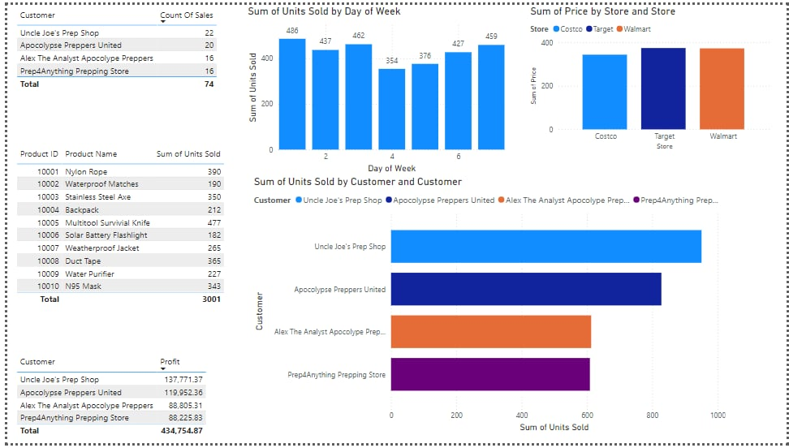

## **Problem Statement**
PEW Retail Inc. Ltd. has subsidiaries across the globe, selling products to various customers scattered across different geographies. They aim to create a consolidated dashboard to meet the following requirements:

1. How much tax is paid based on the various regions they do business in.
2. The number of orders received by various product categories.
3. Identify the top five customers consuming their products.
4. Orders received by various regions across product categories and products.
5. Ensure any changes or additions to the sales data automatically reflect on the dashboard without manual intervention.

---

## **Dataset: CSV File Names and Descriptions**

1. **DimCustomer**  
   - **Description**: Contains detailed information about customers, such as customer IDs, names, contact details, and demographics.

2. **DimGeography**  
   - **Description**: Includes geographical data such as regions, countries, cities, and postal codes.

3. **DimProduct**  
   - **Description**: Contains product details, including product IDs, names, descriptions, and other related attributes.

4. **DimProductCategory**  
   - **Description**: Categorizes products into broader categories like electronics, clothing, etc.

5. **DimProductSubCategory**  
   - **Description**: Provides details of subcategories under each product category for granular analysis.

6. **FactInternetSales**  
   - **Description**: Fact table containing sales data, including transaction details, quantities, revenues, and other metrics for internet sales.

---

## **Relationship Setup**
Before proceeding, ensure all relationships between tables are established. One missing relationship is:  
- **Create a relationship between** `ProductSubCategoryKey` in **DimProductSubCategory** and **DimProduct**.
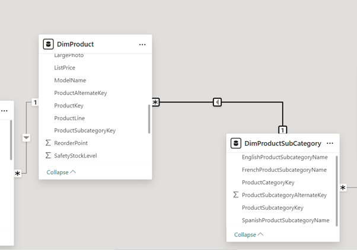

---

## **Steps to Build the Dashboard**

### 1. Tax Paid by Different Countries
- **Quick Measure**:  
  Create a new measure in `FactInternetSales`:
  ```DAX
  Total Tax = SUM(FactInternetSales[TaxAmt])
## Tax Amount by Different Countries
Now this shows tax amount by different countries.
After that, I am going to use a bubble map to create a visualization, and in this map, under the location section, I will place `EnglishCountryRegionname`.

---

## Number of Orders Received by Different Product Categories
To show this information, we can use a clustered column chart:
- Drop the `EnglishProductCategory` into the **x-axis**.
- For the **y-axis**, I need to add a measurable value or a fact value. For that, I add the `SalesOrderNumber` to the **y-axis** and change it to **distinct count** since we may have multiple orders for a single product.

---

## Finding the Top Five Customers by Sales Amount
- First, we should check whether we have a `SalesAmount` column or not:
  - Luckily, we do, but in case we don't, we should create a quick measure for sale amount.

- To visualize the top 5 customers, I choose a **Tree Map**:
  - First, drop `CustomerName` into the tree map and add `SalesAmount`.
  - However, it initially shows all the customers we have, so we need to filter it:
    - Go to the filter bar, set a filter on `CustomerName`.
    - Configure it to display only the **top 5 customers** based on their `SalesAmount`.
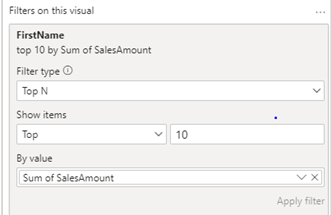

---

## Next, I want to determine which product category has the highest number of orders, right? 
- A bar chart is the best way to easily understand this data.
- Now, I want to compare this information with countries. To do this, I add EnglishCountryName to the x-axis and create a measure for the number of orders using the distinct count of OrderSales. This will provide a clear comparison of product orders across different countries

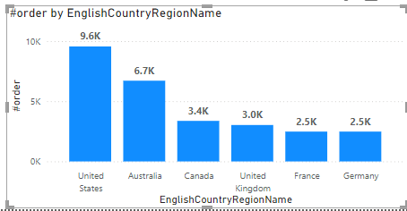

But let's say now I want to find out which product category has the maximum orders in the United States. For example, it shows that there are 9.6K orders—over 9,000 orders. To analyze this further, we need to see the breakdown of these orders by category.

To achieve this, under the data field, we need to add product category name below the x-axis to enable the drill-down functionality. I add English product category to the x-axis, allowing us to drill down into the data and see which product category contributes the most orders in the United States.

## Total Sales Amount by Categories for Each Country

I want to find for each country what is the total sales amount by categories. I choose matrix table. Add country name in rows and I got all coutries. Category in the columns. And I create total sale measure: 
```DAX
total sale = SUM(FactInternetSales[SalesAmount])
Add it into values.

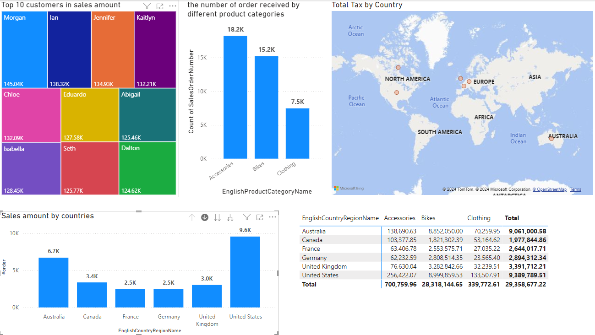
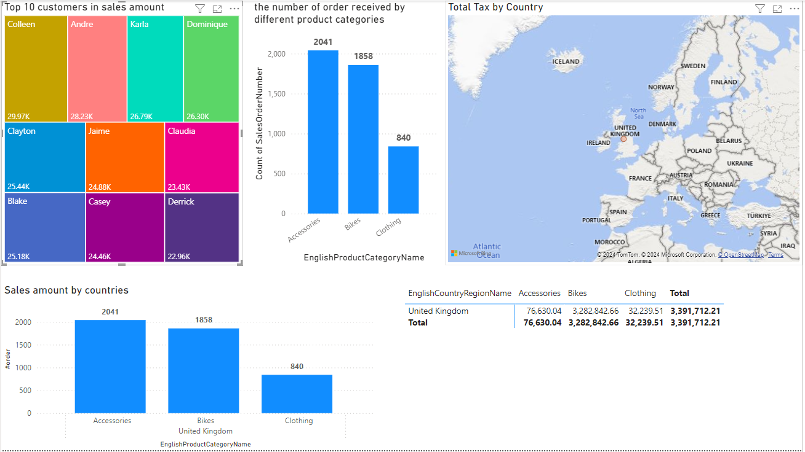


## Project: Apocalypse Sales Performance Dashboard
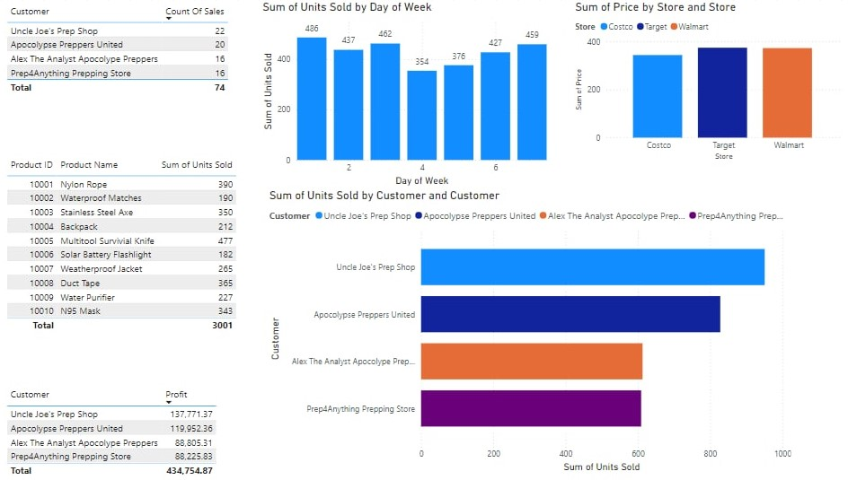

### **Description**
This project is based on the guidance from Alex The Analyst's Power BI course. Using the dataset provided, a comprehensive Power BI report was developed. The process involved integrating data from multiple sources, performing data transformation and modeling, and creating insightful visualizations to analyze sales performance.  
[Download Apocalypse Dataset](https://github.com/AlexTheAnalyst/Power-BI) <!-- Replace `#` with the actual dataset link -->

---

### **Preparing the Data**
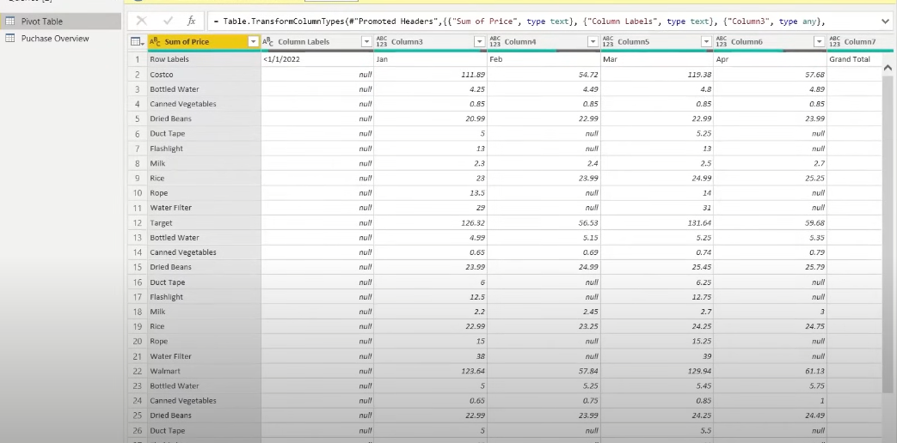

- **Rename Column**: Renamed the `Date` column to `Date_Purchased` in Power Query Editor for better clarity.  
- **Filter Out Milk**: Removed rows where `Product Name` equals "Milk" as it is not relevant in an apocalyptic scenario.  
- **Remove Null Values**: Eliminated null values from the `Apocalypse Food Prep Overview` column to ensure data quality.  
- **Change Data Types**: Corrected the data types for all columns to match their intended formats (e.g., dates, numbers, and text).  
- **Unpivot Column**: Restructured the dataset by unpivoting the `Date` column for analysis readiness.  
- **Create Relationships**: Established relationships between the `Sales`, `Products`, and `Customers` tables to enable accurate data modeling and analysis.  

---

### **DAX Measures**

- **Count of Sales**:  
  Calculated the total number of sales to track transaction volume using the `COUNT` function.  

- **Sum of Products Sold**:  
  Summed up the total quantity of products sold to analyze product performance using the `SUM` function.  

- **Total Profit**:  
  Computed total profit by aggregating the profit for all products, using the `SUMX` function for row-by-row calculations.
- **Day of Week:**
  Added a calculated column to determine the day of the week for each transaction using the `WEEKDAY` function:
---

### **Dashboard**


1. **Sum of Units Sold by Day of Week (Top Left Bar Chart)**  
   - **Type**: Clustered Column Chart  
   - **Description**: This chart shows the total number of units sold for each day of the week.  
   - **Insight**: Helps identify the most active days for sales, allowing businesses to optimize inventory or promotions.  

2. **Sum of Price by Store (Top Right Bar Chart)**  
   - **Type**: Clustered Column Chart  
   - **Description**: Displays the total sales revenue (sum of price) contributed by each store (Costco, Target, Walmart).  
   - **Insight**: Highlights which store generates the highest revenue and can guide store-specific strategies.  

3. **Sum of Units Sold by Customer (Middle Bar Chart)**  
   - **Type**: Stacked Bar Chart  
   - **Description**: Shows the total number of units sold, segmented by customer (e.g., Uncle Joe's Prep Shop, Apocalypse Preppers United).  
   - **Insight**: Identifies top customers in terms of volume, helping target high-value customers.  

4. **Product Details Table (Bottom Left Table)**  
   - **Type**: Table  
   - **Description**: Lists products by Product ID and Name, along with the total number of units sold for each product.  
   - **Insight**: Provides a breakdown of product performance, helping to identify the best-selling items.  

5. **Customer Profit Table (Bottom Left Table)**  
   - **Type**: Table  
   - **Description**: Shows customer names alongside their total profit contribution.  
   - **Insight**: Highlights customers generating the most profit, which is crucial for customer retention strategies.  

6. **Overall Totals (Footer Row of Tables)**  
   - **Description**: Displays the total number of sales, total units sold, and total profit across all customers and products.  
   - **Insight**: Provides a quick snapshot of overall sales performance.  

---

##Project: Data Professional Survey Breakdown

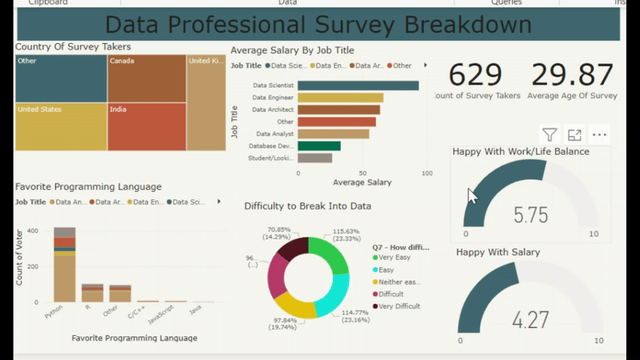

### **Description**
This project is based on the guidance from Alex The Analyst's Power BI course. Using the dataset provided, a comprehensive Power BI report was developed. The process involved integrating data from multiple sources, performing data transformation and modeling, and creating insightful visualizations to analyze survey data.  
[Download Dataset](https://view.officeapps.live.com/op/view.aspx?src=https%3A%2F%2Fraw.githubusercontent.com%2FAlexTheAnalyst%2FPower-BI%2Frefs%2Fheads%2Fmain%2FPower%2520BI%2520-%2520Final%2520Project.xlsx&wdOrigin=BROWSELINK) <!-- Replace `#` with the actual dataset link -->

This dataset is from a survey conducted among data professionals to gather insights about their demographics, job roles, salaries, work-life balance, and challenges in entering the data field.

---

### **Preparing the Data**

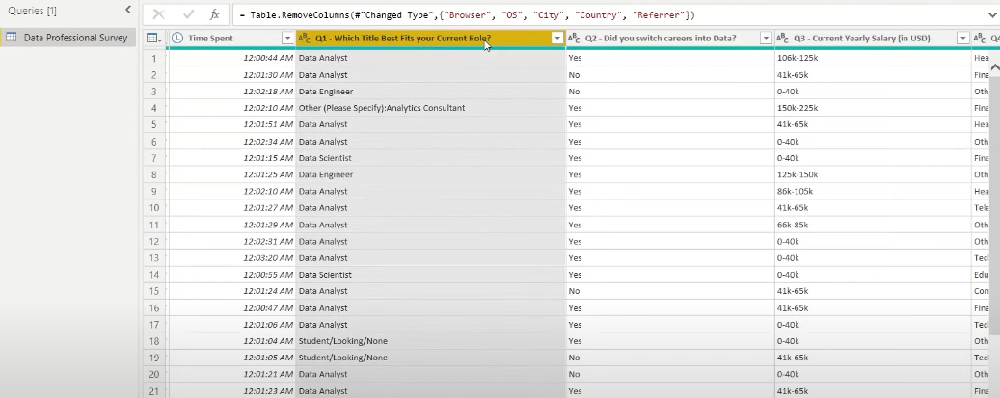

1. **Delete Unused Columns**:  
   - Removed unnecessary columns from the dataset, such as the `Browser` to `Referer` columns.

2. **Clean Q1 (Current Job Title)**:  
   - Used the Split Column feature to clean and standardize the responses for the question:  
     *"Which title fits your current role?"*

3. **Clean Q5 (Favorite Programming Language)**:  
   - Applied the same Split Column technique to clean and organize the responses for the question:  
     *"What is your favorite programming language?"*

4. **Clean Q3 (Current Yearly Salary)**:  
   - Split and replaced values to clean the salary column, ensuring consistency.  
   - Renamed the column to **Average Salary** for better clarity.

5. **Clean the Country Column**:  
   - Standardized and cleaned country names by replacing inconsistent or missing values.

---

### **Dashboard**
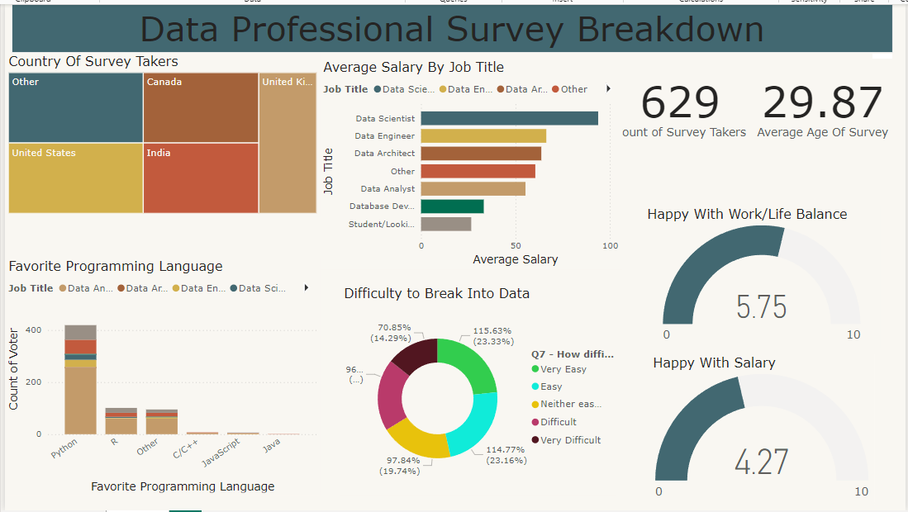

1. **Country of Survey Takers (Top Left: Tree Map)**  
   - **Type**: Tree Map  
   - **Description**: Shows the distribution of survey respondents by country.  
   - **Insight**: Highlights the major countries participating in the survey (e.g., United States, India, Canada).

2. **Average Salary by Job Title (Top Middle: Bar Chart)**  
   - **Type**: Clustered Bar Chart  
   - **Description**: Displays the average salary for each job title, such as Data Scientist, Data Engineer, and Data Analyst.  
   - **Insight**: Identifies the highest-earning roles (e.g., Data Scientist) and compares average salaries across job roles.

3. **Total Survey Takers and Average Age (Top Right: KPI Cards)**  
   - **Type**: KPI Cards  
   - **Description**:  
     - Total count of survey participants: `629`.  
     - Average age of respondents: `29.87` years.  
   - **Insight**: Provides a quick snapshot of the survey demographics.

4. **Favorite Programming Language (Bottom Left: Stacked Bar Chart)**  
   - **Type**: Stacked Bar Chart  
   - **Description**: Shows the count of votes for favorite programming languages (e.g., Python, R, JavaScript) across different job titles.  
   - **Insight**: Highlights Python as the most preferred programming language among data professionals.

5. **Difficulty to Break Into Data (Bottom Middle: Donut Chart)**  
   - **Type**: Donut Chart  
   - **Description**: Visualizes how respondents rated the difficulty of breaking into the data field (e.g., Very Easy, Easy, Difficult).  
   - **Insight**: Shows that a significant percentage found it "Neither Easy nor Difficult," with smaller groups reporting "Very Difficult."

6. **Work-Life Balance and Salary Satisfaction (Bottom Right: Gauges)**  
   - **Type**: Gauges  
   - **Description**:  
     - **Work-Life Balance**: Average satisfaction score of `5.75` out of 10.  
     - **Salary Satisfaction**: Average satisfaction score of `4.27` out of 10.  
   - **Insight**: Provides an overview of how satisfied data professionals are with their work-life balance and compensation.


