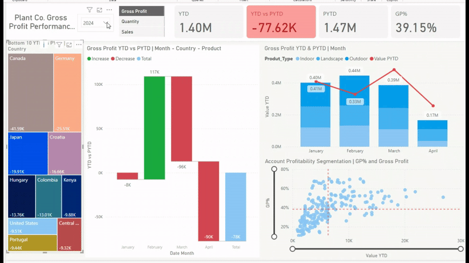

# Projects Showcase

## First Project: Apocalypse Sales Performance Dashboard

### **Description**
This project is based on the guidance from Alex The Analyst's Power BI course. Using the dataset provided, a comprehensive Power BI report was developed. The process involved integrating data from multiple sources, performing data transformation and modeling, and creating insightful visualizations to analyze sales performance.  
[Download Apocalypse Dataset](#) <!-- Replace `#` with the actual dataset link -->

---

### **Preparing the Data**

- **Rename Column**: Renamed the `Date` column to `Date_Purchased` in Power Query Editor for better clarity.  
- **Filter Out Milk**: Removed rows where `Product Name` equals "Milk" as it is not relevant in an apocalyptic scenario.  
- **Remove Null Values**: Eliminated null values from the `Apocalypse Food Prep Overview` column to ensure data quality.  
- **Change Data Types**: Corrected the data types for all columns to match their intended formats (e.g., dates, numbers, and text).  
- **Unpivot Column**: Restructured the dataset by unpivoting the `Date` column for analysis readiness.  
- **Create Relationships**: Established relationships between the `Sales`, `Products`, and `Customers` tables to enable accurate data modeling and analysis.  

---

### **DAX Measures**

- **Count of Sales**:  
  Calculated the total number of sales to track transaction volume using the `COUNT` function.  

- **Sum of Products Sold**:  
  Summed up the total quantity of products sold to analyze product performance using the `SUM` function.  

- **Total Profit**:  
  Computed total profit by aggregating the profit for all products, using the `SUMX` function for row-by-row calculations.  

---

### **Dashboard**

##

1. **Sum of Units Sold by Day of Week (Top Left Bar Chart)**  
   - **Type**: Clustered Column Chart  
   - **Description**: This chart shows the total number of units sold for each day of the week.  
   - **Insight**: Helps identify the most active days for sales, allowing businesses to optimize inventory or promotions.  

2. **Sum of Price by Store (Top Right Bar Chart)**  
   - **Type**: Clustered Column Chart  
   - **Description**: Displays the total sales revenue (sum of price) contributed by each store (Costco, Target, Walmart).  
   - **Insight**: Highlights which store generates the highest revenue and can guide store-specific strategies.  

3. **Sum of Units Sold by Customer (Middle Bar Chart)**  
   - **Type**: Stacked Bar Chart  
   - **Description**: Shows the total number of units sold, segmented by customer (e.g., Uncle Joe's Prep Shop, Apocalypse Preppers United).  
   - **Insight**: Identifies top customers in terms of volume, helping target high-value customers.  

4. **Product Details Table (Bottom Left Table)**  
   - **Type**: Table  
   - **Description**: Lists products by Product ID and Name, along with the total number of units sold for each product.  
   - **Insight**: Provides a breakdown of product performance, helping to identify the best-selling items.  

5. **Customer Profit Table (Bottom Left Table)**  
   - **Type**: Table  
   - **Description**: Shows customer names alongside their total profit contribution.  
   - **Insight**: Highlights customers generating the most profit, which is crucial for customer retention strategies.  

6. **Overall Totals (Footer Row of Tables)**  
   - **Description**: Displays the total number of sales, total units sold, and total profit across all customers and products.  
   - **Insight**: Provides a quick snapshot of overall sales performance.  

---

## Second Project: [Project Name Here]

### **Description**
In this project, ... (Provide a description of the second project here).
